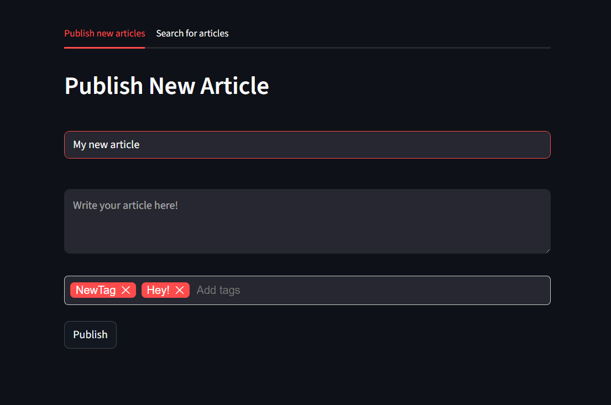
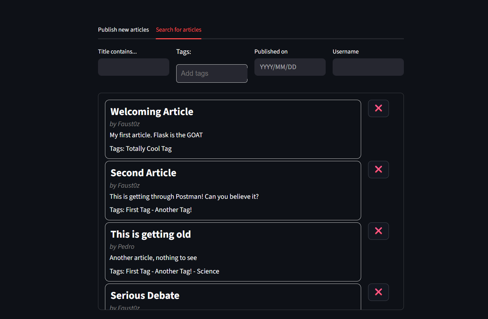
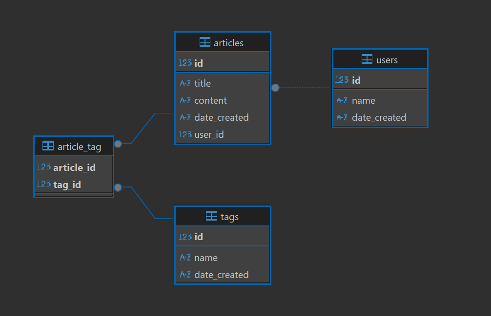

# A simple Personal Python Blogging Platform. 

The app was developed with ***Flask*** + ***SQLite*** to create a REST API and using ***Streamlit*** for a simple frontend. The backend follows a standard **Controller-Service-Repository** pattern (although there's no repository layer in place due to the small scale) using common packages like Marshmallow for data validation and de/serialization and SQLAlchemy+Migrate for database management and connection.

### The web app allows the user to create, view and delete articles. 

### Endpoints (can be tested with the attached Postman collection):
- `GET /articles/` Returns a list of all articles that can be filtered by publishing date, tags, title and user.
- `GET /articles/<id>` Return a single article, specified by the ID.
- `POST /articles` Create a new article to be published and save it to the DB. This article might have tags that might need to be created in the DB.
- `DELETE /articles/<id>` Delete a single article, specified by the ID.
- `GET /tags` return all tags.

# How to Run
- Use Python <3.12
- Execute in a terminal -> `pip install -r requirements.txt` (frontend and backend share this same file)
- Run the `backend/app.py` file to start the REST API
- Execute in a terminal -> `Streamlit run frontend/app.py`

You can locate the app in the IP -> *`localhost:80`*** (can be changed in the "backend/app.py" file)  

Currently, all new articles created from the site are assigned to the user with the user_id=1 for simplicity.

